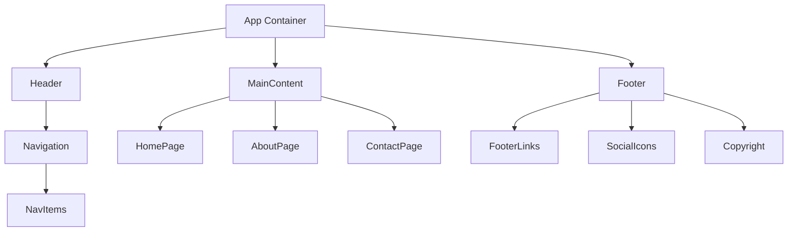

# System Patterns

## Architecture Overview
Website One follows a component-based architecture with clear separation of concerns between presentation, business logic, and data access layers.

## Key Design Patterns
- **Component-Based Structure**: UI elements are built as reusable components
- **Responsive Design Pattern**: Fluid layouts that adapt to different screen sizes
- **Progressive Enhancement**: Core functionality works without JavaScript, with enhanced features for modern browsers
- **Mobile-First Approach**: Design starts with mobile layouts and expands to desktop

## Component Relationships

## Code Organization
- **src/components/**: Reusable UI components
- **src/pages/**: Page-specific components and layouts
- **src/styles/**: Global styles and theme definitions
- **src/utils/**: Utility functions and helpers
- **src/assets/**: Images, icons, and static assets
- **public/**: Static files served directly

## State Management
Simple state management using React's built-in state hooks for component-level state, with context API for global state when necessary.

## Rendering Strategy
- Static site generation for content-focused pages
- Client-side rendering for interactive components
- Server-side rendering for initial page loads to improve SEO and performance

## Performance Considerations
- Code splitting for reduced initial bundle size
- Asset optimization for faster load times
- Lazy loading of non-critical resources
- Caching strategies for static assets 